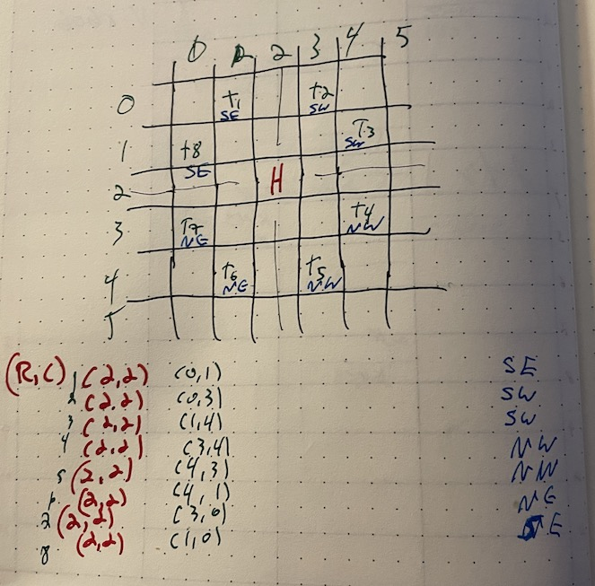

# Advent of Code 2022

This year using AoC to learn C++!  I am some kind of masochist!!11!

Reindeer food!

--------------------------------------------------

## Day 11

https://adventofcode.com/2022/day/11

Shiny Monkey Dog in the Middle

### Part 1

figure once get the parsing done into monkey objects, should be a pretty straightforward
plug and chug with the round-by-round specifics.  (though there's few enough could
manually extract them)

#### Approach

Simple string stuff (substr, a homegrown split) to get each monkey into a struct
that has the various instructions and formulas

#### Solution

98280 (first try!)

#### Twist Guess

MOAR MONKEYS.  Or maybe more complex equations.


#### Learnings

Got to do a sort with a lambda!

```
    sort(monkies.begin(), monkies.end(),
         [](const Monkey &thing1, const Monkey &thing2) -> bool {
             return thing1.inspectedCount > thing2.inspectedCount;
         });
```


### Part 2

No dividing by 3, so numbers gonna keep going up and up.  I can't really figure out the
hint a couple of times.

"find another way to keep your worry levels manageable."

Like another divisor?  Another monkey to monkey algorithm?  Using floats doesn't
seem like it will work with the roundoff and modding it.

#### Approach

Going to try bignums.  Found a header-only one at git@github.com:983/Num.git .

I got round 20 correct with bignums, but things REALLY slow down.  Even with -O3
things grind down around 400, with 12000 digit numbers. So definitely will not
scale to 10,000 rounds.

In case it's the lib, try git@github.com:WindowsNT/N.git.  (gave up on that, between
a syntax error, and difficulties getting things like vector<N<>> working.

just curious, stoachstic debug with the first bignum and see if
there's something unexpected.

not surprisingly, it's in the div_mod

Can we suss out anything with the expected number of iterations?

```
== After round 1000 ==
Monkey 0 inspected items 5204 times.
Monkey 1 inspected items 4792 times.
Monkey 2 inspected items 199 times.
Monkey 3 inspected items 5192 times.

== After round 2000 ==
Monkey 0 inspected items 10419 times.
Monkey 1 inspected items 9577 times.
Monkey 2 inspected items 392 times.
Monkey 3 inspected items 10391 times.
```

over the course of 1000 iterations, 

- Monkey 0 diff 5,215  ratio 2.0021137586
- Monkey 1 diff 4,785  ratio 1.9985392321
- Monkey 2 diff 193    ratio 1.9698492462
- Monkey 3 diff 5,199  ratio 2.001348228


```
== After round 2000 ==
Monkey 0 inspected items 10419 times.
Monkey 1 inspected items 9577 times.
Monkey 2 inspected items 392 times.
Monkey 3 inspected items 10391 times.

== After round 3000 ==
Monkey 0 inspected items 15638 times.
Monkey 1 inspected items 14358 times.
Monkey 2 inspected items 587 times.
Monkey 3 inspected items 15593 times.
```

- Monkey 0 diff 5,219  ratio 1.4965927632
- Monkey 1 diff 4,781  ratio 1.4992168738
- Monkey 2 diff 195    ratio 1.4974489796
- Monkey 3 diff 5,202  ratio 1.5006255413

hrm.  _you'll need to find another way to keep your worry levels manageable_

The problem is that the worry numbers explode. We don't care about what
the values actually are, just checking the divisibility. Wonder if we
can GCD between the four of them, and then scale things back. (of course, if
we stumble in to prime territory...)

alas, we get stuff like
```
  [0] = 1586
  [1] = 28699
  [2] = 35558
  [3] = 118759
  [4] = 68580
  [5] = 178951
  [6] = 21834
  [7] = 25805
  [8] = 29415
  [9] = 29054
```

so no common denomZ.  

All the tests are divisible by primes, if that helps.  All the operators are *, +, or square.

What if we mod the worry level by the divisibility?  Tried that when pushing the item
using both the incoming monkey's divisbility, and the outgoing's.  As usual got numbers
kind of near the ballpark, but not correct.

But basically
* if item-old-worry-level processed by the operation mod the div is 0, then true
so would want
* if (changed item old worry level) processed by the operation mod the div is 0 then true

So that means that the remainder is the same.

operation(iowl) % div = 0
operation(owl) % div = 0

also trying with and without
```
                auto remainder = monkey.items[i] % monkey.divisibility;
                monkey.items[i] /= monkey.divisibility;
//                monkey.items[i] += remainder;
```

#### Solution


#### Learnings

multi GCD


```
int gcd(int a, int b) {
    if (a == 0) return b;
    return gcd(b % a, a);
}

const int multiGCD(const vector<int> &list) {
    int result = list[0];
    for (int i = 0; i < list.size(); i++) {
        result = gcd(list[i], result);
        // all relatively prime, so we're done.
        if (result == 1) return 1;
    }
    return result;
}
```


--------------------------------------------------

## Day 10

https://adventofcode.com/2022/day/10

Cathode-Ray tube

### Part 1

Emulate a little computer

#### Approach

Run through the instructions, emit an extra `noop` instruction before
the addx, that way everything is one cycle (yay RISC), and then process
that looking for the nth cycle

#### Solution

14820 (first try)

#### Twist Guess

Branch instructions


### Part 2

ooh, get to render an image!  Was wondering what the CRT tie-in is.  Getting
Atari 2600 vibes...

* X register controls the horizontal position of a 3-pixel wide sprite
    - the middle of said 3-pixel wide sprite
* We're riding the beam.  Where we draw as the beam goes down the screen controls
  where the pixels go
* 40 x 6 frame buffer, 0...39 indexes, 1...40 for the cycle (cycle one is top, left,
  cycle two is the one after that.
* Left to right starting from the top, then the row below that
* CRT draws a single pixel during each cycle

Should be able to determine is the sprite is visible when a pixel is drawn.
* # is lit, . is dark

#### Approach

Gonna be off by ones, with the 0-index pixel and the 1-index cycle.

woo, got a test pattern working!

```
#..#..#..#..#..#..#..#..#..#..#..#..#..#
..#..#..#..#..#..#..#..#..#..#..#..#..#.
.#..#..#..#..#..#..#..#..#..#..#..#..#..
#..#..#..#..#..#..#..#..#..#..#..#..#..#
..#..#..#..#..#..#..#..#..#..#..#..#..#.
.#..#..#..#..#..#..#..#..#..#..#..#..#..
```


#### Solution

```
###  #### #### #  # #### #### #  #  ##  
#  #    # #    # #  #    #    #  # #  # 
#  #   #  ###  ##   ###  ###  #### #  # 
###   #   #    # #  #    #    #  # #### 
# #  #    #    # #  #    #    #  # #  # 
#  # #### #### #  # #### #    #  # #  # 


#### Learnings

--------------------------------------------------

## Day 9

https://adventofcode.com/2022/day/9

Rope Bridge

### Part 1

Rope has a head and tail (coordinate in a square grid), the head moves, and the
tail gets pulled along.

H and T must alwys be touching (overlapping or adjacent, including diagonals)

If the head ends up two steps away (UDLR), the tail moves one step in that direction.
(this is in the same row and columnnO

If the head and tail aren't touching ,and aren't in the same row or column, the tail
moves one step diagonally to keep up

While simulating the rope, count all the positions the tail visited _at least_ once.

count up those positions.

Prod has 2000 moves.


#### Approach

lot of moving bits here.

* matrix of "tail has visited" flags
* point where H is
* point where T is

For each instruction
  - for the number of moves in that direction
    - move H according to instructions appropriate
    - move T accordingly

Things that'll be intersting

* don't know how large the move matrix will be


So, FIRST off, run through all instructions and get the min/max/width/height
of the world, and use that for the starting point of H an T.

The do the above work.

#### Solution

6018 (second try!  first time had a logic erro in vertical coordinate handling because
of a top-left origin)

#### Twist Guess

My brain hurts from reading the instructions for 8:1 normally, can't think of
anything more elvis.

#### Learnings

Sketch out 2-D geometry.  The diagonal checking logic became very straightforward.



### Part 2

Instead of two knot (head / tail), there's 10 of them

#### Approach

Have an array, apply the move to the head, and then do the "tail move" on each
subsequent one.

#### Solution

2619 (first time!)


--------------------------------------------------
## Day 8

https://adventofcode.com/2022/day/8

_sings_ Treetop Tree House (cambot...)

### Part 1

given a grid of tree/heights (0 shortest)

```
30373
25512
65332
33549
35390
```

count the number of trees that are visible from outside the grid when
looking at a row or column.

A tree is visible if all the other trees between it and an edge of the grid are 
shorter

Prod data is 99x99

#### Approach

* four-state bitflag for each tree - visible from t/l/b/r
* For each tree, walk the four directions
* if it hits the edge, set the visible flag.
* sum all the trees with a visible bit set

#### Solution

1690 (first try!)

#### Twist Guess

diagonals

#### Learnings

### Part 2

different scoring algorithm

#### Solution

535680 (second try :-( )

--------------------------------------------------

## Day 7

https://adventofcode.com/2022/day/7

No Space Left On Device


### Part 1

Trying to run a system update, getting no space on device. Look for
files to delete.

Slurp in a terminal session essentially doing a recursive `ls` with file sizes.

Then, find all the directories with a total size of at **most** 100000. What's
the sum of such directores

#### Approach

We get the terminal session, essentially building a tree.  So

* Walk the input
* `$` is the start of the command. Lines after that are the command output
* `cd` to move around file system
    - no complex paths.  Just "`cd name`
* `ls` to get a listing
* `dir NAME` are directories
* `12345 NAME` are files (includng size)
* `..` exists

Solution thoughts
- We get new files from `cd` and from `ls`
- make a tree of dictionaries
- a key of ".." references the parent
- can do a recursive summing rather than accumulating the size
    - the input is only 1024 lines, so the actual file system stuff should be 
      fairly smol
- for part 1, for each directory calculate the size.  then filter <= 100_000
  and then sum all those. (files can be counted multiple times)

#### Solution

1141028 (first try!)

#### Twist Guess

Don't count files twice?

#### Learnings

:alot: of learning, like

* `cin.peek()` to see if an upcoming line is a command.
* using `std::map`


### Part 2

total space on the filesystem is 70'000'000, need unused space of at
least 30'000'000. Right now it's 48'008'081 (for prod data) of space 
consumed, for 21'991'919 free.

Find the smallest directory that if is deleted, would give us 30meggies of space.


#### Approach

* do the `du` walk
* for each subtract from 70meggies
* if the resulting is <= 30 meggies
    - accumulate the min

#### Solution

8278005 (first try!)

#### Learnings

Horribly messy code is very malleable when you're still working on it. Overall
it's terrible.

--------------------------------------------------

## Day 6

https://adventofcode.com/2022/day/6

Tuning Trouble

Making comm systems work!

### Part 1

Find a four-character window into a string of line noise where each character
is unique. Return the number of characters processed before the first(!)
start of packet marker is detected

#### Approach

* Read in string.
* go character by character
* pick up four characters
* see if all unique (toss in to a set sounds easy)

#### Solution

1855 (first try!)

#### Twist Guess

Since the part one solution description says **first** start of packet, I'm
guessing we'll need to find all the start of packets.  Maybe of differing sizes.

#### Learnings

much consise. very compacting.

```
auto window = line.substr(index, windowSize);
std::set<char> checker(window.begin(), window.end());
````

### Part 2

Twist is 14-character windows.

#### Approach

Change a constant.

#### Solution

3256 (first try!)

#### Learnings

--------------------------------------------------

## Day 5

https://adventofcode.com/2022/day/5

Supply Stacks

Parsing a picture!  Then running through "move X of something one at a time
from stack to stack".

### Part 1

Stacks will be important.

Cool ASCII art:
```
    [D]    
[N] [C]    
[Z] [M] [P]
 1   2   3 

move 1 from 2 to 1
...
```

Considerately it's full of spaces, so easy indexing

#### Approach

Need to make stacks out of each, well, stack.

Figured:
* read in the lines
* process backwards, so all the stacks are filled in
* once we've hit a space above a crate we can stop processing
  that stack
* then stream the instructions, which will be a "for count, pop A push B"
* report the top of each stack as a string, e.g. "CDB"

#### Solution

TLNGFGMFN (first time!)

#### Twist Guess

Super crane that can move 2 at a time.

#### Learnings

lldb and stdin:
```
(lldb) break set -y day-5-1.cpp:47
(lldb) settings set target.input-path day-5-example.txt
(lldb) process launch
```

### Part 2

Twist: the crane can move multiple crates, so it won't have the single pop/push
behavior. Instead all of the move.

#### Approach

I'm sure there's a "move range of stuff from one vector to another", so can
change to vectors (still building like a stack yay push_back) and use that.

#### Solution

FGLQJCMBD (First time!)

#### Learnings

Yep there was a way to move stuff

```
        too.insert(too.end(), 
                   make_move_iterator(fromm.begin() + (fromm.size() - icount)),
                   make_move_iterator(fromm.end()));
```

The fromm still has "" for the things that were removed, so needed to trim

```
        fromm.resize(fromm.size() - icount);
```

--------------------------------------------------

## Day 4

https://adventofcode.com/2022/day/4

Camp Cleanup

Cleaning up the camp before more supplies can be unloaded. Elves are
assigned the job of cleaning up sections of the camp.

- Every section has a unique ID
- each elf is assigned a (single) range of (multiple) section IDs
- elves are pairing up, e.g.
```
2-4,6-8  // elf1 sections 2,3,4, elf2 sections 6,7,8
2-3,4-5
5-7,7-9
```


### Part 1

Some overlap, some are distinct, and some fully contain others (like
the outer two here)

```
....567..  5-7
......789  7-9

.2345678.  2-8
..34567..  3-7

.....6...  6-6
...456...  4-6
```

Question: how many of these fully contain the other?

#### Approach

- Make a range type (start/end)
- have a contains method
- parse the file
- see how many of the paris (e1.contains(e2) or e2.contains(e1)
- sum them

#### Solution

507 (first try!)

#### Twist Guess

Determine which sections aren't being covered?  Maybe something with overlaps?
Or maybe three elves contribute to the overlap ranges?

#### Learnings

REGEX! for pulling apart the ##-## chunks.

```
const auto matchElfRanges = "(\\d*)-(\\d*),(\\d*)-(\\d*)";
std::regex matchRangesRegex(matchElfRanges);
std::smatch matches;
if (std::regex_search(line, matches, matchRangesRegex)) {
    // use matches[1] ... matches[3] for the guts.
}
```

Also, there's :alot: of line noise in C++
```
[[nodiscard]] constexpr const bool contains(const Range &otherRange) noexcept {
```


### Part 2

Twist is, if the number pairs overlap at all.

#### Approach

Right now `Range` has a "contans", so should be easy to add an intersect.
`||` instead of `&&` or some such thing.

#### Solution

897 (did not get first try. Needed to double-up on my contains check)

--------------------------------------------------

## Day 3

https://adventofcode.com/2022/day/3

Rucksack reorganization.

There's a set of rucksacks, each with the same number of items.
Items are keyed by upperand lowercase characters. `F` is one thing and
`f` is another.  Given a description of the rucksack contents, e.g, 
_"vJrwpWtwJgWrhcsFMMfFFhFp"_, split it in half for each rucksack
vJrwpWtwJgWr and hcsFMMfFFhFp, and find the error (the same item in both,
so a lower case p)

Then score them 1-26 (lowercase) and 27-52 (uppercase) by "the priority
of the item type that apears in both compartments.

The example doesn't have overlapping found items - do they just want the
_type_ (so if `p` appears 17 times in the data, then it contributes singly to
the total) or the actual itmes (so it contributes 17 times to the total).
_(turns out it was the latter)_

The example also show exactly one conflict, but can there be multiple?
Guess we'll find out.  _(Turns out exactly one)_

### Part 1

#### Approach

The actual work seems pretty straightforward:
  - split string in half
  - dump each character in to a set
  - intersect the sets
  - score the contents of the sets

#### Solution

7742 (first time!)

#### Twist Guess

Probably will involve fixing the rucksacks - given all the leftovers, distribute
them so there's no conflicts

#### Learnings

Data structures and algorithms are kind of awkward.  Like intersecting a set:

```
        set<char> intersect;
        set_intersection(ruck1.begin(), ruck1.end(),
                         ruck2.begin(), ruck2.end(),
                         inserter(intersect, intersect.begin()));
```

Getting the first element of a set (might not be arbitrary):
`char blah = *intersect.begin();`


### Part 2

Group by three, and find the commonaltiy between three of the elve's rucksacks.

#### Approach

Sounds like more of the same - instead of splitting a line and intersecting
two sets, instead nom three lines, and intersect three sets.

#### Solution

2276 (first time!)

#### Learnings

I've made this error twice:

```
set<char> fromString(const string &s) {
    set<char> thing;
    for (int i = 0; i < s.length(); i++) {
        thing.insert(s[i]);  // originally did just thing.insert(i)
    }
    return thing;
}
```
I'm sure there's a concise idiomatic way of doing this

--------------------------------------------------

## Day 2

https://adventofcode.com/2022/day/2

Rock Paper Scissors!

### Part 1

Data:

* Column 1
    - A : Rock
    - B : Paper
    - C : Scissors
* Column 2 (supposition)
    - X : Rock
    - Y : Paper
    - Z : Scissors
* scoring
    - Shape Score
        - 1 : Rock
        - 2 : Paper
        - 3 : Scissors
    - Round Score
        - 0 : lost
        - 3 : drawn
        - 6 : won

Then sum up :all-the-things:. What is the total score.

#### Approach

2500 lines in the prod data set.  Shouldn't be a problem - linear scan,
calculate, sum.  

#### Solution

9651. First try.

#### Twist Guess

Guessing that XYZ stand for different things. Might be dependent on
the first column. Might be a backtracking thing. "X for what your opponent
chose two rounds ago".  Or maybe it turns in to rock paper scissors lizard spock
Or maybe it's calculate the opponent score too.

#### Learnings

Opportunity to learn up on enum classes (a.k.a. scoped enumerations).  Basically
a scoping/namespacing mechanism (no methods like in swift-land). Does allow
for switch-exhaustiveness checking.

Doesn't seem to be a `split`, but stringstreams come close for space-delimited ones.

```
        std::stringstream ss(line);
        std::string opponent, player;
        ss >> opponent;
        ss >> player;
```


### Part 2

Twist is:

* Column 2
    - X : Lose
    - Y : Draw
    - Z : Win

#### Approach

Add a couple of "convert RPS move X into win/lose" and use the existing scoring 
functions.

#### Solution

10560 (first try!)

--------------------------------------------------

## Day 1

https://adventofcode.com/2022/day/1

### Part 1

We get a list of numbers separated by blank lines.  Each group
of numbers is an Elf's local food supply in calories.  e.g. sample:

```
1000
2000
3000

4000

5000
6000

7000
8000
9000

10000
```
Elf 1 has 6000 calories, second elf is 4000 calories, etc.

One elf is carrying the most calories,  what is that value?
In this case, it's 24000 from the fourth elf.

#### Approach

* Stream the file in
* nom numbers as they come in and sum them
* when hit a blank line, max the current max and the running sum
* go to nom numbers until hit new line
* return the max

#### Solution

69626

_(of course, my solution is different than yours)_


#### Twist Guess

I imagine the twist will involve knowing which elf has the most
calories - my obvious solution is not keeping track of **which** specific
elf has all the calories, just how many total.

#### Learnings

* `getline(cin, lineString)` to read a line from stdin
* use `line.empty()` to see the blank space
* `stoi(lineString)` to convert string to integer.

### Part 2

The twist is - keep track of the top _three_ elves calories, and
calculate that sum.

For the example, the top three elves are the fourth (24000),
third (11000), fifth (10000).

So don't need the identity of the elf

#### Approach

instead of letting the sums float by / keeping the max.  Dump into
an array. Sort. Take the top 3.  Sum them.

(there's also an approach from Data Oriented Design that might 
look at if there's time)

#### Solution

206780

==================================================

## Day X

https://adventofcode.com/2022/day/X
Subtitle

### Part 1

#### Approach

#### Solution

#### Twist Guess

#### Learnings

### Part 2

#### Approach

#### Solution

#### Learnings
